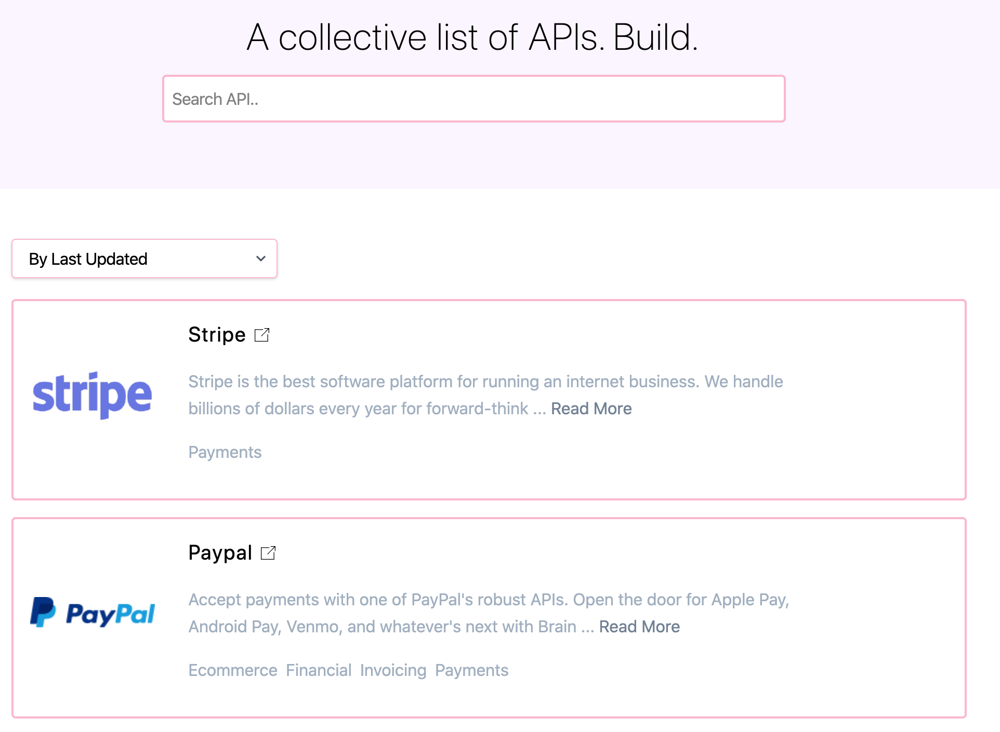
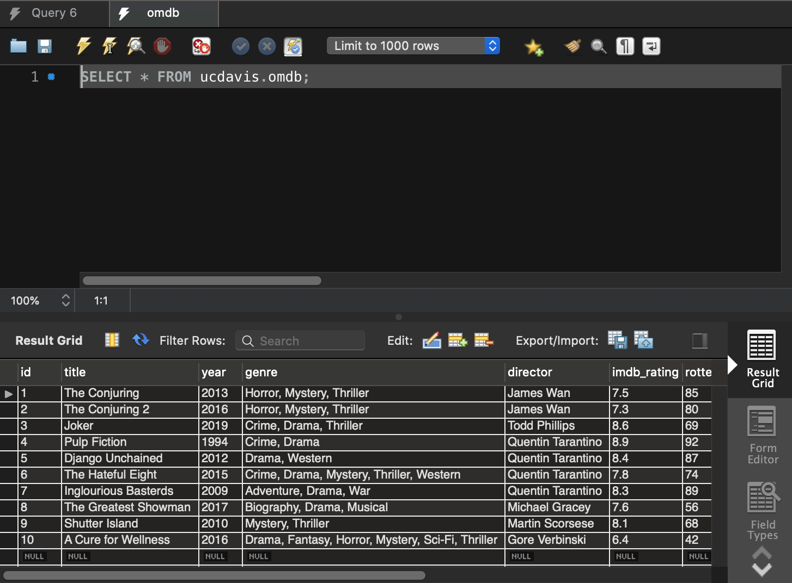

# Build-your-movie-database
Using public API (here is IMDb) to request data and build the pipeline in Python to store the data into my local MySQL sever. A quick demonstration in Python, and summary of some bugs and concepts to utilize. 
 ***ALL the code is in this [jupyter notebook](https://github.com/TeddyWang0202/Build-your-movie-database/blob/master/Python_SQL_IMDb.ipynb)***  

### Why do we need API when we could use <code>requests</code> and <code>bs4</code> to retrieve data?
There is always sometime we need to fetch data from the websites, but retrieving web data by iterative <code>requests</code> and then parsing by <code>bs4</code> would be painful. First of all, the html data might be hard to parse or even some of the data are generated dynamically, making parsing one level harder. Secondly, you always have to wait the whole data to be rendered by web server and then catch the data to do further parsing and digesting. It's a more general way to scrape data, though. However, **when there is a more convinent way to request data, why bother yourself to pretend as a user and scrape data from the original web page?** If a website provides its own API(Not many do, thou), we could leverage it and get the data more efficiently. Therefore, below is how we use API.

1. Finding whether there is a API you could leverage, and I recommend [API list](https://apilist.fun/) to look up for. 
2. Here because I want to build the IMDb movie database, so I use [OMDb's API](http://www.omdbapi.com/).
3. After finding the API, then explore it, to know:
    1. What is the URL you need to request to get the data. Some of them might need key, so register it. (OMDb provides free key)
    2. What data does the request return. Most of them are in json format, and it goes to the next section.

### After we get the data using API, how to store into your local database?
Here I use Python to requests the data and use <code>json</code> package to parse the requested data. After parsing, use <code>mysql-connector-python</code>(I encountered some bugs in <code>mysql-connector</code>, so I don't suggest to use it.) to build the link between Python and MySQL. This package provides methods that you just need to create the connection object and cursor object, and you could do everything the same as you do in your MySQL query.
1. import package <code>import mysql.connector</code>
2. create connection object <code>conn = mysql.connector.connect()</code>
3. create cursor object <code>mycursor = conn.cursor()</code>
4. execute query (Create table, insert, query, etc) <code>cursor.execute</code>
5. Final result:
   

Also, there are some takeaways I encounter and feel helpful for first-time users.
1. When connect to your local database, most of the default setting is \{"user":"root"\} and \{"host":"localhost"\}. You can alter the server password to <code>''</code> to make it easier to access.
2. When insert/query the data, always ends with <code>conn.commit()</code>(<code>conn</code> is a connection object between Python and MySQL) to make the result really implemented in MySQL. When insert/query fails, use <code>conn.rollback()</code> to redo everything before the execution, making less mess in your table.
3. When some errors or bugs happen, Python kernel might be stuck and need to restart the kernel.(here I still don't know other solutions instead of restarting kernel)
4. **The execution method, <code>cursor.execute()</code>, has different string reference than original Python. It only accepts <code>%s</code>. For example, <code>cur.execute( "SELECT * FROM omdb WHERE year IS '%s'", (2020))</code>, even the reference is not string type(might be integer, float, etc), this method still accepts <code>%s</code> only.**
